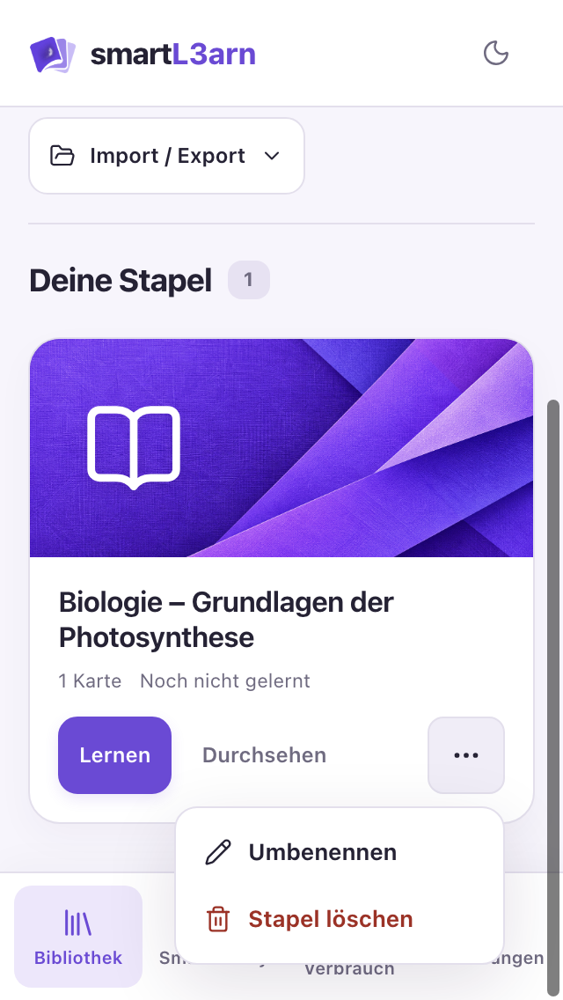
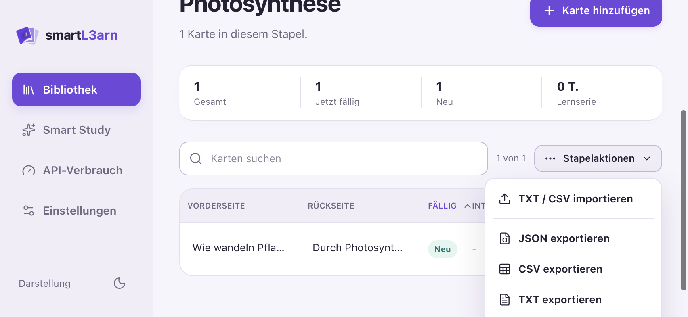

# Layout-, Dropdown- und Sicherheitsprüfung

**Nachträgliche Korrekturen:** Die Befunde unten beschreiben den ursprünglichen Zustand. Umgesetzte Änderungen, Tests und verbleibende Grenzen stehen in [FIXES.md](FIXES.md).

Datum: 05.10.2026. Geprüft wurde der aktuelle Projektstand, ohne Produktcode zu ändern.

## Ergebnis

Die auffälligsten Layoutfehler betreffen geöffnete Aktionsmenüs: In den vorhandenen iOS-Webdateien reicht das Kartenaktionsmenü im Querformat über den sichtbaren Bildschirm hinaus. Im aktuellen Quellstand kommt eine Kollision mit der inzwischen unten angeordneten Navigation hinzu. Das Hauptproblem der Sicherheitsprüfung ist ein tatsächlich im vorhandenen Desktop-Release enthaltener API-Schlüssel im Klartext. Weitere reproduzierte Probleme betreffen untrusted JSON-Importe und CSV-Exporte.

## Methode und Grenzen

Der integrierte Browser war nicht verfügbar. Stattdessen wurden der vorhandene isolierte Electron-Test und eine zusätzliche lokale Renderhilfe mit künstlichen Lerninhalten ausgeführt. Der aktuelle Web-Build wurde neu erstellt. Die zusätzliche Prüfung erzeugte jeweils 60 Screenshots des aktuellen Quellstands und der vorhandenen iOS-Webdateien bei 320×568, 393×852 und 852×393 CSS-Pixeln. Die ursprüngliche mobile Testhilfe prüfte zusätzlich 768 und 1280 Pixel Breite und einen KI-Fehler mit erfolgreicher Wiederholung, jeweils mit simulierten API-Antworten.

Die Screenshots stammen aus Chromium/Electron, **nicht aus einem iOS-Simulator oder von einem iPhone**. Für die zusätzliche Prüfung wurden CSS-Safe-Area-Werte angenähert: unten 34 Pixel im Hochformat, links/rechts 59 und unten 21 Pixel im Querformat. Eine Statusleistenüberlagerung wurde nicht angenommen, weil die Anwendung `setOverlaysWebView({ overlay: false })` setzt. Die tatsächliche WKWebView, Bildschirmtastatur, Dynamic Type, VoiceOver und die geöffneten nativen iOS-Auswahlfenster wurden nicht geprüft. Es wurde keine Anfrage mit einem echten API-Schlüssel ausgelöst.

Die bereits nach `ios/App/App/public` kopierten Assets unterscheiden sich vom frisch erstellten Web-Build. Screenshots direkt neben diesem Bericht prüfen den aktuellen Quellstand; Screenshots unter `ios-assets/` prüfen die tatsächlich im iOS-Projekt gespeicherten Webdateien. Die iOS-Assets wurden nicht überschrieben. Beide Versionen enthalten dieselben Menüpositionierungsregeln, aber unterschiedliche mobile Navigation und Dialogregeln.

Die Layout-Metriken prüfen horizontale Ausdehnung und einige benachbarte Bedienelemente. Sie sind keine vollständige automatische Überlappungserkennung; Safe-Area-Kandidaten können auch hinter Dialogen oder in geschlossenen Menüs liegende Elemente einschließen. Die folgenden sichtbaren Befunde beruhen auf geöffneten und geprüften Screenshot-Dateien.

## Geprüfte Schritte im aktuellen Quellstand

| Schritt | Ansicht / Zustand | Ergebnis | Akzeptierte Screenshot-Evidenz |
|---|---|---|---|
| 1 | Bibliothek, Import/Export geöffnet | Hochformat im gezeigten Zustand unauffällig; Menü besitzt keine Platzanpassung | [Import/Export](small-transfer-menu.png) |
| 2 | Bibliothek, Stapelmenü am Seitenende | Fehler: Menü überdeckt Navigation | [320 Pixel](small-deck-menu-bottom.png), [393 Pixel](phone-deck-menu-bottom.png) |
| 3 | Kartenverwaltung, Aktionsmenü | Fehler: Navigation überdeckt; im Querformat untere Aktionen abgeschnitten | [Hochformat klein](small-browse-menu.png), [Hochformat größer](phone-browse-menu.png), [Querformat](landscape-browse-menu.png) |
| 4 | Kartenverwaltung, Sortierfeld geschlossen | Feld im gezeigten Zustand lesbar; nativer Auswahlpopup ungeprüft | [Kartenverwaltung](small-browse.png) |
| 5 | Klassisches Lernen, Frage und Seitenende | Keine sichtbare Elementüberlappung in den gezeigten Zuständen | [Kleines Display](small-study-bottom.png), [größeres Display](phone-study-bottom.png) |
| 6 | Smart-Study-Einrichtung | Keine sichtbare Überlappung im gezeigten Zustand | [Einrichtung](small-smart.png) |
| 7 | Smart-Study-Sitzung | Keine sichtbare Überlappung im gezeigten Zustand; weiteres Scrollen nötig | [Sitzung](small-smart-session.png) |
| 8 | Einstellungen, Sprachfeld geschlossen | Keine sichtbare Überlappung; nativer Auswahlpopup ungeprüft | [Einstellungen](small-preferences.png) |
| 9 | API-Verbrauch, Filter geschlossen | Fehler: Zeitraumbezeichnung auf kleinem Display abgeschnitten | [API-Filter](small-usage.png) |
| 10 | Karten-/Stapeleditor | Im Hochformat keine bestätigte Überlappung; Querformat erfordert Scrollen, Safe-Area-Risiko | [Karte klein](small-card-editor.png), [Karte größer](phone-card-editor.png), [Karte quer](landscape-card-editor.png) |

## Separater Abgleich der vorhandenen iOS-Webdateien

| Zustand | Ergebnis | Screenshot |
|---|---|---|
| Import/Export bei 320 Pixeln | Im geprüften Zustand vollständig sichtbar | [iOS-Dateien](ios-assets/small-transfer-menu.png) |
| Stapelmenü am Seitenende | Keine Kollision mit unterer Navigation: Diese Version hat die Navigation oben; Menü reicht bis an den unteren Bildschirmrand | [320 Pixel](ios-assets/small-deck-menu-bottom.png), [393 Pixel](ios-assets/phone-deck-menu-bottom.png) |
| Kartenaktionsmenü im Hochformat | Im geprüften Zustand vollständig sichtbar; keine untere Navigation in dieser Version | [iOS-Dateien](ios-assets/small-browse-menu.png) |
| Kartenaktionsmenü im Querformat | Unterster Menüteil ebenfalls abgeschnitten | [iOS-Dateien](ios-assets/landscape-browse-menu.png) |
| API-Zeitraumfilter bei 320 Pixeln | Auswahlbezeichnung ebenfalls abgeschnitten | [iOS-Dateien](ios-assets/small-usage.png) |
| Karteneditor bei 393 Pixeln | Im geprüften Hochformat keine sichtbare Überlappung | [iOS-Dateien](ios-assets/phone-card-editor.png) |

Die installierte App auf einem Gerät kann nochmals einen anderen Build enthalten. Ein Abgleich mit einem installierten IPA wurde nicht durchgeführt.

## Layoutbefunde und Empfehlungen

### L1 – Aktionsmenüs kollidieren mit Navigation und Bildschirmrand – hohe Priorität

Bei Schritt 2 überdeckt das offene Stapelmenü mehrere Navigationspunkte. Bei Schritt 3 ist dasselbe Verhalten bei 320 Pixel Breite sichtbar. Im Querformat reicht das größere Menü über den unteren Bildschirmrand; insbesondere die unterste Umbenennen-Aktion ist im Screenshot nicht sichtbar.

Die Navigationüberlagerung gilt für den aktuellen Quellstand. Das Abschneiden im Querformat wurde auch beim separaten Rendern der bereits vorhandenen iOS-Webdateien bestätigt.

Ursache: [style.css](../../style.css#L723) positioniert `.menu-popover` absolut immer unter seinem Auslöser. Es gibt weder eine Prüfung des verfügbaren Platzes noch eine maximale Höhe mit internem Scrollen. Der spätere `z-index: 70` lässt diese Menüs über der Navigation erscheinen. Das Überdecken des darunterliegenden Karteninhalts ist bei einem Popover erwartbar; die Kollision mit festen Navigationspunkten und dem Bildschirmrand ist der Fehler.

Empfehlung: Menüs passend zum verfügbaren Platz nach oben oder unten öffnen, innerhalb der seitlichen Safe Areas halten, ihre Höhe begrenzen und Inhalte bei Bedarf im Menü scrollen. Die feste Navigation muss bei der Platzberechnung berücksichtigt werden. Anschließend beide Enden der Seite und Querformat erneut prüfen.





### L2 – API-Filtertext wird abgeschnitten – mittlere Priorität

Bei Schritt 9 ist „Gesamter Zeitraum“ im linken Auswahlfeld nicht vollständig lesbar. Die beiden Filter stehen auch auf 320 Pixel breiten Displays nebeneinander. Die Regel in [ApiUsageView.vue](../../src/views/ApiUsageView.vue#L255) reduziert die Mindestbreite und gibt beiden Feldern denselben flexiblen Platz.

Dieselbe Kürzung ist auch im separat geprüften vorhandenen iOS-Bundle sichtbar.

Empfehlung: Filter auf schmalen Displays untereinander anordnen und genügend Platz für Auswahltext und Pfeil reservieren. Lange Modellnamen ebenfalls prüfen. Die Darstellung des geöffneten nativen iOS-Pickers muss separat auf iOS überprüft werden.

### L3 – Seitliche Safe Areas im Querformat fehlen – mittlere Priorität

Die iOS-Konfiguration erlaubt beide Querformate. Bei 852 Pixel Breite verwendet die Oberfläche eine feste linke Seitenleiste. Ihre Bedienelemente beginnen bereits bei x=15 Pixel, obwohl ein angenäherter Notch-Abstand von 59 Pixeln berücksichtigt werden müsste. [Querformat-Screenshot](landscape-home.png), [Layoutregeln](../../style.css#L2839).

Empfehlung: Seitenleiste, Werkzeugleisten, Lernoberfläche und Menüs um die jeweiligen linken/rechten Safe-Area-Abstände ergänzen. Das ist ein belegtes fehlendes CSS-Inset; die konkrete physische Notch-Überdeckung bleibt mangels echtem iOS-Lauf ungeprüft.

### L4 – Editor-Safe-Area ist uneinheitlich – mittlere Priorität, bedingt bestätigt

Die mobile Regel in [style.css](../../style.css#L3180) ersetzt die zuvor vorhandenen Safe-Area-Abstände durch pauschale 12 Pixel. Im geprüften 393×852-Hochformat war der Dialog dennoch weit genug vom unteren Rand entfernt. Eine tatsächliche Überlappung dieses Zustands ist damit **nicht bestätigt**. Im Querformat reicht der maximale Kartendialog bis y=375 bei 393 Pixel Höhe; das unterschreitet den angenäherten unteren Schutzabstand von 21 Pixeln um 3 Pixel. Die allgemeine Maximalhöhe berücksichtigt Safe Areas nicht vollständig.

Die mobile 12-Pixel-Override-Regel fehlt in den älteren iOS-Webdateien. Dieser konkrete zusätzliche Rückschritt betrifft daher den aktuellen Quellstand für den nächsten synchronisierten Build.

Empfehlung: Dialogabstände und Maximalhöhe aus derselben Safe-Area-Berechnung ableiten. Bei geöffneter iOS-Tastatur beide Editoren und den Speichern-Button prüfen. Das automatische Fokussieren der Felder macht diesen Test besonders relevant.

### Bedienbarkeit und Barrierefreiheit

Viele mobile Hauptaktionen haben bereits Mindesthöhen von 44 Pixeln. Lange Titel umbrechen in der Kartenverwaltung und werden im Lernheader gezielt gekürzt. Die auf Screenshots sichtbaren Grundlayouts sind weitgehend stabil.

Die Dropdowns sind native `<details>`-Elemente mit Buttons. Es gibt im eigenen Menücode keine zentrale Schließlogik für Außenklick, Escape oder ein anderes geöffnetes Menü. Ein gemeinsames Verhalten und die Tastaturbedienung sollten separat getestet werden. Aus den Screenshots lässt sich keine vollständige Barrierefreiheit ableiten.

## Sicherheitsbefunde

### S1 – API-Schlüssel im ausgelieferten Desktop-Paket – hoch, bestätigt

[embed-openrouter-config.cjs](../../scripts/embed-openrouter-config.cjs#L16) schreibt `OPENROUTER_API_KEY` aus Prozessumgebung oder `.env` in die Datei `openrouter-build-config.json` im Ressourcenverzeichnis. Der `afterPack`-Hook aktiviert dieses Verhalten für Desktop-Builds. Die Runtime liest diesen Schlüssel bevorzugt vor einem verschlüsselt gespeicherten Ersatzschlüssel.

Im vorhandenen Artefakt `release/1.0.3/mac-arm64/smartL3arn.app/Contents/Resources/openrouter-build-config.json` wurde ein nicht leerer API-Schlüssel bestätigt. Sein Wert wurde weder ausgegeben noch in diesen Bericht übernommen. Wer dieses App-Paket erhält, kann die Datei lesen und den Schlüssel außerhalb der App verwenden. Die sichere Speicherung eines später eingetragenen Schlüssels schützt den mitgelieferten Schlüssel nicht.

Empfehlung: Private API-Schlüssel nicht in verteilbare Desktop-Builds aufnehmen. Eigene Schlüssel der Nutzer sicher speichern oder einen authentifizierten serverseitigen Vermittler verwenden. Falls dieses Paket bereits weitergegeben wurde, den enthaltenen Schlüssel widerrufen/ersetzen und die Nutzung prüfen. Die Schlüsselgültigkeit wurde nicht getestet.

**iOS-Abgrenzung:** [embed-ios-openrouter-config.cjs](../../scripts/embed-ios-openrouter-config.cjs#L9) entfernt die private Konfiguration für alle Nicht-Debug-Builds; die Swift-Runtime liest sie ausschließlich unter `#if DEBUG`. Das ist durch bestehende Tests abgesichert. Debug-Pakete können trotzdem einen Klartextschlüssel enthalten und sollten entsprechend behandelt werden. Ein gebautes iOS-Release wurde nicht untersucht.

### S2 – JSON-Import ermöglicht Veränderung von Object.prototype – mittel, reproduziert

[importer.ts](../../src/services/importer.ts#L13) übernimmt Karten-IDs aus Backups ungeprüft. Die Statistiklogik in [study.ts](../../src/stores/study.ts#L65) und [smartStudy.ts](../../src/stores/smartStudy.ts#L330) greift über `deck.cardStats[card.id]` auf ein gewöhnliches Objekt zu.

Eine Karte mit ID `__proto__` führt im reproduzierten Import-und-Bewerten-Ablauf dazu, dass das geerbte `Object.prototype` als Statistikobjekt verwendet wird. Danach besitzt `Object.prototype` ein eigenes Feld `reviews` mit dem Wert `NaN`. Das verändert globale Objektzustände in derselben JavaScript-Laufzeit und kann Statistiken oder weitere Logik stören. Voraussetzung ist der Import eines manipulierten Backups und anschließendes Bewerten. Eine Codeausführung oder Datenübertragung wurde nicht nachgewiesen.

Empfehlung: IDs validieren oder neu vergeben und Statistikzuordnungen mit sicheren eigenen Eigenschaften beziehungsweise prototypfreien Objekten erstellen. `__proto__`, `constructor` und `prototype` dürfen keine unkontrollierten Statistikschlüssel sein. Auch bestehende gespeicherte Daten müssen beim Laden validiert werden.

### S3 – CSV-Export schützt nicht vor Tabellenformeln – mittel, reproduziert

[csvEscape](../../src/domain/importExport.ts#L119) behandelt CSV-Trennzeichen, Quotes und Zeilenumbrüche, aber keine Formelpräfixe. Ein Karteninhalt `=1+1` wird unverändert als Zelle exportiert. Das kann beim Öffnen in einer Tabellenkalkulation als Formel interpretiert werden. Ob gefährlichere Formeln Daten abrufen können, hängt von der Zielanwendung und deren Schutzmechanismen ab. Es wurde keine Tabellenkalkulation geöffnet und keine externe Formel ausgeführt. Siehe [OWASP: CSV Injection](https://community.owasp.org/attacks/CSV_Injection).

Empfehlung: Einen für Tabellenkalkulationen sicheren CSV-Export definieren, Formelpräfixe wie `=`, `+`, `-`, `@` und relevante Steuerzeichen berücksichtigen und die Lösung in den unterstützten Zielprogrammen testen. JSON bleibt als unveränderter Backup-Export geeignet.

### S4 – Importe werden nicht vollständig validiert oder begrenzt – mittel, reproduziert / statisch bestätigt

Das vollständige fremde Deckobjekt wird per Spread übernommen; lediglich Name, ID und Karten werden danach überschrieben. Der Reproduktionstest bestätigt, dass `sessions: 'invalid'` und `cardStats: 'invalid'` akzeptiert werden. Auch ein Kartenfeld mit 100.000 Zeichen wird angenommen. Datei-, Kartenanzahl- und Textgrößen werden vor dem vollständigen Einlesen nicht begrenzt.

Das kann spätere Statistikansichten oder Bewertungen beschädigen und bei sehr großen Dateien die App blockieren. Eine konkrete maximale Dateigröße, ab der ein Gerät abstürzt, wurde nicht ermittelt.

Empfehlung: Zulässige Felder explizit übernehmen, Datentypen und Zahlenbereiche für alle Backupfelder prüfen, doppelte/reservierte IDs behandeln und vor `file.text()` ein Dateigrößenlimit setzen. Die lokale Desktop- und Browser-Persistenz sollte beim Laden denselben Validator benutzen.

### S5 – Electron fehlen zusätzliche Herkunfts- und Navigationsgrenzen – mittlere Härtungspriorität

Die IPC-Handler in [main.js](../../main.js) ignorieren die Herkunft des Aufrufs. Es fehlen eine `senderFrame`-Prüfung, eine Navigations-Allowlist und eine Sperre unerwarteter neuer Fenster. Das ist **kein nachgewiesener eigenständiger Einbruchspfad**: Der Renderer lädt derzeit lokale Inhalte, Vue rendert Lerntexte als Text, Node-Integration ist ausgeschaltet und Context Isolation ist aktiv. Falls fremder JavaScript-Code in einen berechtigten Renderer gelangt, könnten aber Datenspeicher- und KI-Operationen aufgerufen werden.

Empfehlung: IPC nur für das erwartete Hauptfenster und dessen lokale Hauptseite zulassen, unnötige Navigation/Fenster sperren sowie Payloads im Main-Prozess begrenzen. Diese Maßnahmen entsprechen den [offiziellen Electron-Sicherheitsempfehlungen](https://www.electronjs.org/docs/latest/tutorial/security).

### S6 – iOS-KI-Bridge erlaubt einen weitgehend freien Requestbody – mittlere Härtungspriorität

Die Swift-Methode `request` in [SceneDelegate.swift](../../ios/App/App/SceneDelegate.swift) prüft ein JSON-Objekt und eine Grenze von 64.000 Bytes. Modell, Nachrichten, `max_tokens` und weitere API-Parameter sind im nativen Code aber weitgehend frei; die engere Validierung in `ai.ts` lässt sich von anderem Code im selben WebView-Kontext umgehen. Die URL ist fest und die Requestgröße begrenzt – eine frei wählbare Ziel-URL wurde nicht gefunden.

Empfehlung: Auch nativ ausschließlich den vorgesehenen Bewertungsauftrag akzeptieren und Modell-/Token-/Parallelitätsgrenzen erzwingen. Ein Missbrauch würde zunächst JavaScript-Ausführung im App-Kontext voraussetzen; ein solcher Einstieg wurde nicht nachgewiesen.

## Bereits vorhandene Schutzmaßnahmen

- Vue-Templates rendern die geprüften Karten- und KI-Inhalte als Text; keine produktive `v-html`- oder `innerHTML`-Ausgabe gefunden.
- Electron setzt `nodeIntegration: false` und `contextIsolation: true`. Process Sandboxing wurde nicht abgeschaltet; aktuelle Electron-Versionen aktivieren es standardmäßig. [Electron-Dokumentation](https://www.electronjs.org/docs/latest/tutorial/security).
- Die CSP beschränkt Skripte auf eigene Quellen und verbietet Objekte sowie Formularübermittlungen. Die noch erlaubten lokalen HTTP-/WebSocket-Verbindungen können für Produktionsbuilds enger gefasst werden.
- OpenRouter-Zieladressen sind fest und verwenden HTTPS. Die iOS-Konfiguration enthält keine allgemeine ATS-Ausnahme.
- Benutzerschlüssel werden unter iOS im Keychain mit `kSecAttrAccessibleWhenUnlockedThisDeviceOnly` gespeichert; der Electron-Ersatzschlüssel verwendet `safeStorage` und eine Datei mit Modus 0600.
- Verbindungslogs verwenden Feld-/Werte-Allowlisten und schreiben keine Schlüssel, Fragen, Antworten oder rohen Fehlertexte. Debuglogs werden rotiert.
- `.env` ist ignoriert und gehört nicht zu den getrackten Dateien. Der bestätigte Schlüsselfund entsteht durch den Packaging-Hook.
- Lerninhalte liegen auf Desktop als JSON und im Browser/iOS-WebView in Local Storage. Eine eigene Verschlüsselung der Lerninhalte ist nicht implementiert; der Schutz hängt vom Betriebssystem und der Gerätesperre ab.
- Die Einrichtung weist sichtbar darauf hin, welche Lerninhalte im KI-Modus an OpenRouter gesendet werden. Aktuelle Anbieterbedingungen oder rechtliche Datenschutzkonformität wurden nicht bewertet.

## Ausgeführte Prüfungen

| Prüfung | Ergebnis |
|---|---|
| `npm run build:web` | Erfolgreich, einschließlich TypeScript-Prüfung |
| `npm run test` | 54 Electron-Tests und 85 Vue-/Domain-Tests bestanden |
| Vorhandener `scripts/check-mobile.cjs` | 20 Route-/Breitenkombinationen ohne horizontalen Dokumentüberlauf; KI-Fehler/Wiederholung erfolgreich |
| Zusätzliche Renderhilfe | 120 Screenshots: 60 aktueller Quellstand, 60 vorhandene iOS-Webdateien; Versionsunterschiede separat dokumentiert |
| Sicherheits-Reproduktionstests | 3 bestanden: bestätigen die bestehenden Import-/Prototyp-/CSV-Probleme, nicht deren Behebung |
| Native Swift-Journalprüfung | 19 Checks bestanden |
| `npm audit --json` | 0 gemeldete bekannte Schwachstellen bei 547 erfassten Abhängigkeiten |

Ein positives npm-Audit ist keine Aussage über die eigene Anwendungslogik, alle nativen Abhängigkeiten oder zukünftige Schwachstellen. Native iOS-SPM-/Android-Abhängigkeiten wurden nicht gegen eine separate Advisory-Datenbank geprüft. Signierung, Berechtigungen eines gebauten iOS-Archivs, produktive Updateserver und ein vollständiger Penetrationstest sind nicht Teil dieses Berichts.

## Reproduktion und nächste Schritte

Die Prüfdateien und Originalscreenshots liegen neben diesem Bericht. `check-layout.cjs` arbeitet ausschließlich mit einer eigenen temporären Electron-Session und Testdaten. Persönliche Daten werden nicht geladen. Die drei Sicherheits-Reproduktionen können ausgeführt werden mit:

```sh
./node_modules/.bin/vitest run --config design-audit/ios-security-2026-10-05/vitest.config.mts
```

Empfohlene Reihenfolge: verteilte Desktop-Schlüssel entfernen/gegebenenfalls widerrufen, Importvalidierung und Prototypzugriffe absichern, Dropdownpositionierung korrigieren, CSV-Export absichern, anschließend die verbleibenden Safe-Area-/Tastatur-/Pickerzustände auf echtem iOS überprüfen.
